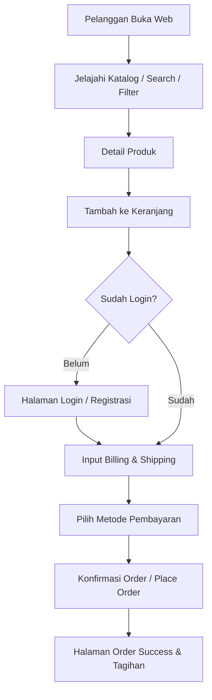

# 02. Product Requirements Document (PRD) - E-Shopper

## 1. Ringkasan Produk
**E-Shopper** mencakup dua komponen utama antarmuka:
1. **Front-End Portal**: Ditujukan bagi publik/pelanggan untuk pencarian produk, filter kategori/brand, kalkulasi keranjang belanja, registrasi/login, dan pembuatan pesanan.
2. **Back-End Admin Panel**: Ditujukan bagi pengelola toko untuk manajemen inventaris, manajemen pesanan/invoice, serta pengelolaan pesan kontak pelanggan.

---

## 2. User Stories

### Pelanggan (Customer)
* **US-01**: Sebagai pelanggan, saya ingin dapat melihat daftar produk terbaru dan terpopuler di halaman utama agar dapat menemukan barang yang dicari dengan cepat.
* **US-02**: Sebagai pelanggan, saya ingin dapat memfilter produk berdasarkan kategori, sub-kategori, brand, dan rentang harga agar katalog lebih spesifik.
* **US-03**: Sebagai pelanggan, saya ingin dapat menambahkan produk ke keranjang belanja dan melihat rincian harga (subtotal, pajak 2%, ongkir) sebelum pembayaran.
* **US-04**: Sebagai pelanggan, saya ingin melakukan registrasi akun secara aman dan login tanpa khawatir kata sandi dibocorkan.
* **US-05**: Sebagai pelanggan, saya ingin menerima pengesahan transaksi setelah berhasil melakukan *place order*.

### Pengelola (Admin)
* **US-06**: Sebagai admin, saya ingin melakukan autentikasi login yang terlindungi dari serangan *brute-force* agar portal admin aman dari akses ilegal.
* **US-07**: Sebagai admin, saya ingin mengelola (tambah, edit, hapus) data produk, kategori, dan brand barang.
* **US-08**: Sebagai admin, saya ingin melihat dan memproses daftar pemesanan dari pelanggan.
* **US-09**: Sebagai admin, saya ingin melihat dan membalas pesan masuk dari form kontak pelanggan.

---

## 3. User Flow

---

## 4. Acceptance Criteria

| Fitur | Kriteria Penerimaan (Acceptance Criteria) |
|:---|:---|
| **Keranjang Belanja** | Jumlah pembelian tidak boleh melebihi stok produk yang tersedia di database. |
| **Kalkulasi Total** | Subtotal dihitung server-side. Pajak $2\%$ ditambahkan ke subtotal. Ongkir $= \$0$ jika subtotal $\ge \$30$, else $\$15$. |
| **Keamanan Form** | Seluruh form input harus menyertakan token CSRF dan melakukan sanitasi output (anti-XSS). |
| **Rate Limiting Login** | Terblokir sementara (lockout 15 menit) setelah 5x kesalahan kata sandi berturut-turut. |
