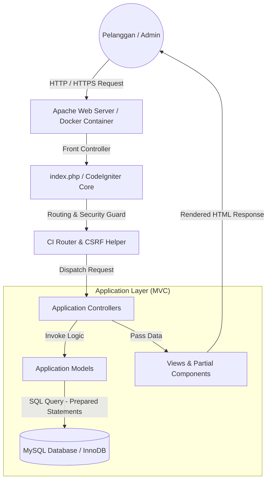

# 04. System Architecture - E-Shopper

## 1. Ringkasan Arsitektur
Aplikasi **E-Shopper** dibangun berbasis arsitektur **Monolithic Model-View-Controller (MVC)** menggunakan framework **CodeIgniter 3.1.6+** yang berjalan di atas runtime **PHP 8.3**.

Sistem memanfaatkan pemisahan tugas (*Separation of Concerns*) yang jelas antara penanganan logika HTTP (*Controller*), pengelolaan query data (*Model*), dan penyajian antarmuka pengembang/publik (*View*).

---

## 2. Tech Stack

| Komponen | Teknologi / Library | Keterangan |
|:---|:---|:---|
| **Runtime Language** | PHP 8.3.10 | Digunakan dalam mode Production / NTS x64 |
| **Framework Web** | CodeIgniter 3.1.6 / 3.1.13 | Lightweight MVC Web Framework |
| **Database System** | MySQL 8.0 / MariaDB (Engine: InnoDB) | Storage relational dengan transaksi & FK |
| **Testing Framework** | PHPUnit 10.0.0 | Unit & Feature automated testing suite |
| **Frontend Framework** | HTML5, CSS3, Bootstrap 3, jQuery 1.10 | Responsive layout & UI components |
| **Package Manager** | Composer 2.7+ | Manajemen ketergantungan library PHP |
| **Containerization** | Docker & Docker Compose | Container Image (`php:8.3-apache` & `mysql:8.0`) |
| **CI/CD Automation** | GitHub Actions | Automated linting, PHPUnit testing, & Docker build |
| **Web Server Environment** | Apache 2.4 / Nginx / Laragon | Server HTTP penanganan rewrite URL (`.htaccess`) |

---

## 3. Diagram Arsitektur Sistem



---

## 4. Struktur Folder Aplikasi

```
eshopper/
├── .github/workflows/      # GitHub Actions CI/CD pipeline (ci-cd.yml)
├── application/
│   ├── config/             # Konfigurasi aplikasi (database, routes, autoload)
│   ├── controllers/        # HTTP Controller (Home, Cart, Checkout, Admin, dll.)
│   ├── helpers/            # Helper fungsi kustom (csrf_helper)
│   ├── models/             # Data Access Object / Query Models
│   └── views/              # Template HTML Front & Back Admin
├── system/                 # Framework Core Engine CodeIgniter
├── tests/                  # Automated Test Suite (Unit & Feature)
│   ├── unit/               # Unit test cases
│   └── feature/            # Feature / HTTP test cases
├── uploads/                # Direktori penyimpanan media/gambar produk
├── docs/                   # Dokumentasi lengkap proyek
├── Dockerfile              # Docker Container build instructions
├── docker-compose.yml      # Multi-container orchestration (Web + MySQL)
├── .dockerignore           # Exclude rules for Docker build
├── composer.json           # Dependensi project PHP
├── phpunit.xml             # Konfigurasi PHPUnit
└── index.php               # Front Controller Entry Point
```
