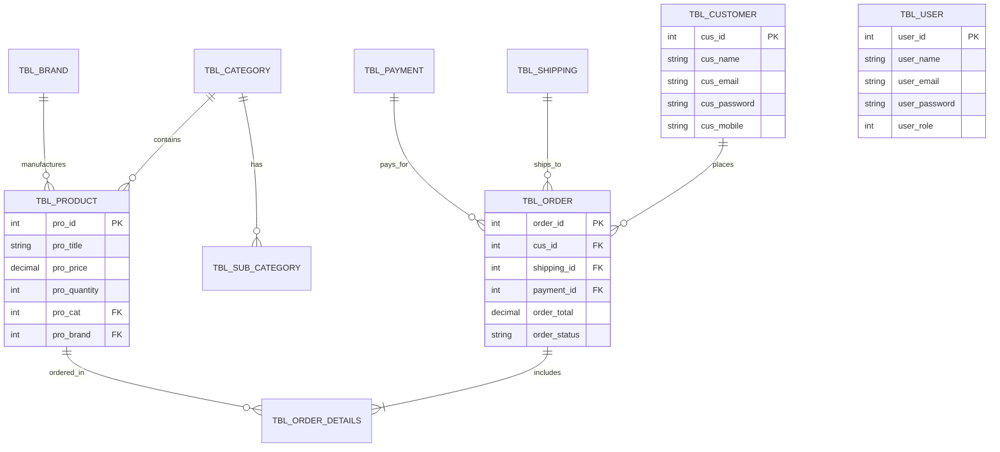

# 05. Database Documentation - E-Shopper

## 1. Ringkasan Skema Database
Database **`eshopper`** menggunakan sistem manajemen basis data relasional **MySQL** dengan seluruh 11 tabel berkonfigurasi **`ENGINE=InnoDB`** dan **`CHARSET=latin1` / `utf8mb4`**.

Storage Engine **InnoDB** digunakan untuk memastikan dukungan terhadap **ACID Transactions**, **Foreign Key Constraints**, dan **Row-Level Locking** guna menghindari *race condition* pada stok produk.

---

## 2. Entity Relationship Diagram (ERD)

---

## 3. Kamus Data (Data Dictionary)

### 3.1 Tabel `tbl_user` (Pengelola Admin)
| Kolom | Tipe Data | Nullable | Keterangan |
|:---|:---|:---:|:---|
| `user_id` | `INT(11)` | NO | Primary Key, Auto Increment |
| `user_name` | `VARCHAR(255)` | NO | Nama lengkap pengguna admin |
| `user_email` | `VARCHAR(255)` | NO | Email login admin |
| `user_password` | `VARCHAR(255)` | NO | Hash password (Bcrypt 60 char) |
| `user_status` | `TINYINT(3)` | NO | Status akun (1: Active, 0: Blocked) |

### 3.2 Tabel `tbl_customer` (Pelanggan)
| Kolom | Tipe Data | Nullable | Keterangan |
|:---|:---|:---:|:---|
| `cus_id` | `INT(11)` | NO | Primary Key, Auto Increment |
| `cus_name` | `VARCHAR(255)` | NO | Nama pelanggan |
| `cus_email` | `VARCHAR(255)` | NO | Email unik pelanggan |
| `cus_password` | `VARCHAR(255)` | NO | Hash kata sandi (Bcrypt 60 char) |
| `cus_mobile` | `VARCHAR(50)` | YES | Nomor HP pelanggan |

### 3.3 Tabel `tbl_product` (Katalog Produk)
| Kolom | Tipe Data | Nullable | Keterangan |
|:---|:---|:---:|:---|
| `pro_id` | `INT(11)` | NO | Primary Key, Auto Increment |
| `pro_title` | `VARCHAR(255)` | NO | Nama/Judul produk |
| `pro_desc` | `TEXT` | YES | Deskripsi rinci produk |
| `pro_price` | `FLOAT` | NO | Harga produk per unit |
| `pro_quantity` | `INT(11)` | NO | Jumlah stok tersisa |
| `pro_image` | `VARCHAR(255)` | YES | Path file gambar produk |

### 3.4 Tabel `tbl_order` (Transaksi Pemesanan)
| Kolom | Tipe Data | Nullable | Keterangan |
|:---|:---|:---:|:---|
| `order_id` | `INT(11)` | NO | Primary Key, Auto Increment |
| `customer_id` | `INT(11)` | NO | Foreign Key ke `tbl_customer` |
| `shipping_id` | `INT(11)` | NO | Foreign Key ke `tbl_shipping` |
| `payment_id` | `INT(11)` | NO | Foreign Key ke `tbl_payment` |
| `order_total` | `FLOAT` | NO | Total belanja (Subtotal + Tax + Shipping) |
| `order_status` | `VARCHAR(50)` | NO | Status (Pending, Completed, Cancelled) |
